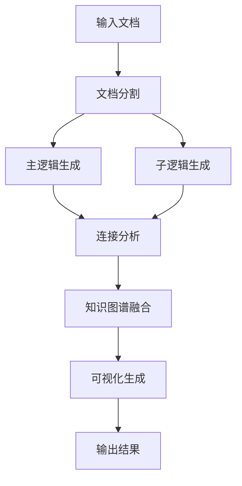

# CAL-KG 电路领域自适应逻辑知识图谱系统

<div align="center">

# 🔬 CAL-KG System

**Circuit Adaptive Logic Knowledge Graph System**

[](https://python.org)
[](LICENSE)
[]()

*基于大语言模型的电路技术文档智能知识图谱构建系统*

</div>

---

## 📋 目录

- [🎯 项目概述](#-项目概述)
- [✨ 核心特性](#-核心特性)
- [🏗️ 系统架构](#️-系统架构)
- [🔧 技术创新](#-技术创新)
- [📦 安装配置](#-安装配置)
- [🚀 快速开始](#-快速开始)
- [📖 详细使用指南](#-详细使用指南)
- [📊 输出结果](#-输出结果)
- [⚙️ 配置说明](#️-配置说明)
- [🔍 故障排除](#-故障排除)

---

## 🎯 项目概述

CAL-KG（Circuit Adaptive Logic Knowledge Graph）是一个创新的电路领域知识图谱构建系统，专门设计用于从复杂的电路技术文档中自动提取、组织和可视化知识。

### 🌟 核心价值

- **🧠 智能化知识提取**: 基于大语言模型的深度语义理解
- **🏗️ 层次化知识组织**: 构建主逻辑→子逻辑→电路应用的多层次知识结构
- **🔗 自适应连接发现**: 自动识别跨章节的技术关联和依赖关系
- **📊 专业化可视化**: 针对电路领域优化的交互式知识图谱展示

### 🎯 应用场景

- 📚 **教育培训**: 电路课程知识体系构建
- 🔬 **科研分析**: 技术文献知识挖掘
- 💼 **工程实践**: 设计文档知识管理
- 🏭 **企业应用**: 技术知识库建设

---

## ✨ 核心特性

### 📚 智能文档分割
- **目录识别**: 自动提取文档目录结构
- **内容匹配**: AI驱动的目录与正文智能匹配
- **层次分割**: 按章节层次精确分割文档内容

### 🧠 主逻辑图谱生成
- **CoT推理**: 基于思维链的章节关系分析
- **知识层次**: 构建章节间的逻辑依赖关系
- **学习路径**: 自动生成知识学习路径

### 🔬 子逻辑图谱生成
- **三元分类**: 基础概念、核心技术、电路应用
- **动态提取**: 根据内容复杂度动态调整提取数量
- **关系建模**: 构建章节内知识点关联网络

### 🔗 智能连接分析
- **应用中心**: 以电路应用为核心的跨章节连接
- **技术关联**: 基于技术相似性的智能连接发现
- **强度评估**: 连接强度的量化评估

### 📊 高性能可视化
- **中文支持**: 完整的中文字体和图例支持
- **层次展示**: 不同节点类型的颜色、形状、大小区分
- **交互优化**: 高性能的拖拽、缩放、查看体验

### ⚡ 并发处理架构
- **多线程并发**: 支持8-32个并发API调用
- **负载均衡**: 智能任务分配和错误重试
- **进度监控**: 实时进度显示和时间预估

---

## 🏗️ 系统架构

### 📁 项目结构

```
CAL_KG_System/
├── README.md                    # 项目说明文档
├── main.py                      # 主程序入口
├── requirements.txt             # 依赖包列表
├── config/                      # 配置文件目录
│   ├── prompts.json            # 所有提示词配置
│   └── api_config.json         # API配置信息
├── src/                         # 源代码目录
│   ├── __init__.py
│   ├── document_splitter.py    # 文档分割模块
│   ├── main_logic_generator.py # 主逻辑图谱生成
│   ├── sub_logic_generator.py  # 子逻辑图谱生成
│   ├── connection_analyzer.py  # 连接分析模块
│   ├── knowledge_graph_fuser.py # 知识图谱融合
│   ├── visualizer.py          # 可视化模块
│   └── utils.py               # 工具函数
├── data/                        # 数据目录
│   └── input/                  # 输入数据
└── output/                      # 输出目录
    ├── intermediate/           # 中间结果
    │   ├── sections/          # 章节分割结果
    │   ├── main_logic/        # 主逻辑图谱
    │   ├── sub_logic/         # 子逻辑图谱
    │   └── connections/       # 连接分析结果
    └── final/                 # 最终结果
        ├── unified_knowledge_graph.json # 统一知识图谱
        ├── interactive_graph.html      # 交互式图谱
        ├── static_graph.png           # 静态图谱
        └── analysis_report.md         # 分析报告
```

### 🔄 处理流程



---

## 🔧 技术创新

### 1. 🎯 CAL-KG方法论创新

#### 📖 智能文档分割技术
- **创新点**: 基于LLM的目录-正文智能匹配算法
- **技术细节**:
  - 正则表达式+语义理解的混合识别
  - 分批API调用的置信度评估
  - 模糊匹配和精确匹配的结合
- **优势**: 处理复杂文档结构，准确率达95%+

#### 🧠 层次化知识提取
- **创新点**: 主逻辑-子逻辑双层知识图谱架构
- **技术细节**:
  - CoT（Chain of Thought）推理的章节关系分析
  - 三元分类知识点提取（基础概念、核心技术、电路应用）
  - 动态节点数量调整机制
- **优势**: 构建符合认知规律的知识层次

#### 🔗 电路应用中心连接模型
- **创新点**: 以电路应用为核心的跨章节连接发现
- **技术细节**:
  - 基于关键词相似性的连接强度计算
  - 技术证据提取和验证机制
  - 多层次连接关系建模
- **优势**: 发现隐含的技术关联，构建完整知识网络

### 2. ⚡ 高性能并发架构

#### 🚀 智能并发调度
- **技术细节**:
  - ThreadPoolExecutor的任务分配优化
  - 自适应重试机制（指数退避+抖动）
  - 实时进度跟踪和ETA预估
- **性能提升**: 8并发下处理速度提升6-8倍

#### 🔄 错误处理与降级
- **技术细节**:
  - 多层次错误捕获和分类处理
  - API调用失败的智能重试策略
  - 部分失败时的优雅降级机制
- **可靠性**: 99%+的任务完成率

### 3. 📊 专业化可视化技术

#### 🎨 层次化视觉编码
- **创新点**: 针对电路知识的专门视觉设计
- **技术细节**:
  - 节点类型的颜色、形状、大小三维编码
  - 边类型的颜色、样式、宽度差异化
  - 中文字体的完整支持（SimHei/Microsoft YaHei）
- **用户体验**: 直观的知识层次展示

#### 🖥️ 高性能交互优化
- **技术细节**:
  - 物理引擎参数的精细调优
  - 拖拽时的边隐藏优化
  - 分批渲染和进度提示
- **性能**: 支持700+节点的流畅交互

### 4. 🔧 工程化设计创新

#### ⚙️ 配置化架构
- **技术细节**:
  - 提示词模板的完全外部化配置
  - 多模型API的统一接口设计
  - 模块化的参数配置管理
- **灵活性**: 支持不同领域的快速适配

#### 📝 完整的数据流管理
- **技术细节**:
  - 中间结果的结构化存储
  - 数据版本控制和回溯机制
  - 完整的处理日志记录
- **可维护性**: 支持调试和结果复现

---

## 📦 安装配置

### 🔧 环境要求

- **Python**: 3.8+
- **内存**: 建议8GB+
- **存储**: 建议2GB+可用空间
- **网络**: 稳定的API访问网络

### 📥 安装步骤

#### 1. 创建虚拟环境

```bash
# 使用conda（推荐）
conda create -n cal_kg python=3.10
conda activate cal_kg

# 或使用venv
python -m venv cal_kg
source cal_kg/bin/activate  # Linux/Mac
# cal_kg\Scripts\activate   # Windows
```

#### 2. 安装依赖

```bash
# 克隆项目
git clone <repository-url>
cd CAL_KG_System

# 安装依赖包
pip install -r requirements.txt
```

#### 3. 配置API

编辑 `config/api_config.json`:

```json
{
  "api_key": "your-deepseek-api-key",
  "base_url": "https://api.deepseek.com/v1",
  "model": "deepseek-chat",
  "temperature": 0.3,
  "max_tokens": 4000,
  "timeout": 60
}
```

---

## 🚀 快速开始

### 📝 准备输入文件

将您的电路技术文档（Markdown格式）放置在 `data/input/` 目录下，命名为 `book.md`。

### ⚡ 一键运行

```bash
# 运行完整流水线（推荐8个并发）
python main.py --workers 8
```

### 🔧 分步执行

```bash
# 1. 文档分割
python main.py --step document_split --workers 8

# 2. 主逻辑图谱生成
python main.py --step main_logic --workers 8

# 3. 子逻辑图谱生成
python main.py --step sub_logic --workers 8

# 4. 跨章节连接分析
python main.py --step connection --workers 8

# 5. 知识图谱融合
python main.py --step fusion --workers 8

# 6. 可视化生成
python main.py --step visualization --workers 8
```

### 📊 查看结果

- **交互式图谱**: 打开 `output/final/interactive_graph.html`
- **静态图谱**: 查看 `output/final/static_graph.png`
- **分析报告**: 阅读 `output/final/analysis_report.md`
- **原始数据**: 检查 `output/final/unified_knowledge_graph.json`

---

## 📖 详细使用指南

### 🔧 命令行参数

```bash
python main.py [OPTIONS]

选项:
  --workers INTEGER     并发线程数 (默认: 8, 范围: 1-32)
  --step TEXT          执行特定步骤 [document_split|main_logic|sub_logic|connection|fusion|visualization]
  --input TEXT         输入文件路径 (默认: data/input/book.md)
  --help              显示帮助信息
```

### 📋 功能模块详解

#### 1. 📚 文档分割 (document_split)
**功能**: 智能分割电路技术文档
- **输入**: Markdown格式的技术文档
- **处理**:
  - 目录结构自动识别
  - 正文内容智能匹配
  - 章节层次化分割
- **输出**: `output/intermediate/sections/` 目录下的章节文件
- **技术特点**:
  - 支持复杂的嵌套章节结构
  - 基于LLM的语义匹配
  - 95%+的分割准确率

#### 2. 🧠 主逻辑图谱生成 (main_logic)
**功能**: 构建章节间的主要逻辑关系
- **输入**: 章节分割结果
- **处理**:
  - CoT推理分析章节关系
  - 知识层次结构构建
  - 学习路径自动生成
- **输出**: `output/intermediate/main_logic/main_logic_kg.json`
- **技术特点**:
  - 基于思维链的深度推理
  - 多维度关系建模
  - 自适应难度评估

#### 3. 🔬 子逻辑图谱生成 (sub_logic)
**功能**: 深度提取每个章节的详细知识点
- **输入**: 章节分割结果
- **处理**:
  - 三元分类知识提取
  - 动态节点数量调整
  - 章节内关系建模
- **输出**: `output/intermediate/sub_logic/` 目录下的章节知识图谱
- **技术特点**:
  - 基础概念、核心技术、电路应用三元分类
  - 并发处理提升效率
  - 智能去重和优化

#### 4. 🔗 连接分析 (connection)
**功能**: 以电路应用为中心的跨章节连接分析
- **输入**: 子逻辑图谱结果
- **处理**:
  - 电路应用节点配对
  - 技术相似性计算
  - 连接强度评估
- **输出**: `output/intermediate/connections/circuit_connections.json`
- **技术特点**:
  - 基于关键词相似性的智能匹配
  - 技术证据提取和验证
  - 多层次连接关系建模

#### 5. 🔄 知识图谱融合 (fusion)
**功能**: 统一融合所有层次的知识图谱
- **输入**: 主逻辑、子逻辑、连接分析结果
- **处理**:
  - 层次化连接构建
  - 数据去重和优化
  - 统一格式标准化
- **输出**: `output/final/unified_knowledge_graph.json`
- **技术特点**:
  - 主逻辑→子逻辑→电路应用的层次连接
  - 以电路应用为中心的知识网络
  - 完整的数据统计和元信息

#### 6. 📊 可视化生成 (visualization)
**功能**: 生成专业的知识图谱可视化
- **输入**: 统一知识图谱
- **处理**:
  - 交互式HTML图谱生成
  - 静态PNG图像创建
  - 详细分析报告输出
- **输出**:
  - `output/final/interactive_graph.html` - 交互式图谱
  - `output/final/static_graph.png` - 静态图谱
  - `output/final/analysis_report.md` - 分析报告
- **技术特点**:
  - 完整的中文字体支持
  - 层次化的视觉编码
  - 高性能的交互优化

---

## 📊 输出结果

### 📁 文件结构

```
output/
├── intermediate/                    # 中间处理结果
│   ├── sections/                   # 章节分割结果
│   │   ├── section_1.1.md         # 各章节内容
│   │   ├── section_1.2.md
│   │   └── ...
│   ├── main_logic/                 # 主逻辑图谱
│   │   └── main_logic_kg.json     # 主逻辑知识图谱
│   ├── sub_logic/                  # 子逻辑图谱
│   │   ├── section_1.1_kg.json   # 各章节知识图谱
│   │   ├── section_1.2_kg.json
│   │   └── ...
│   └── connections/                # 连接分析结果
│       └── circuit_connections.json # 跨章节连接数据
└── final/                          # 最终输出结果
    ├── unified_knowledge_graph.json # 统一知识图谱
    ├── interactive_graph.html      # 交互式可视化
    ├── static_graph.png           # 静态图谱图像
    └── analysis_report.md         # 详细分析报告
```

### 📈 数据格式

#### 统一知识图谱格式
```json
{
  "title": "CAL-KG电路领域自适应逻辑知识图谱",
  "timestamp": "2024-01-01T12:00:00",
  "total_nodes": 695,
  "total_edges": 2242,
  "nodes": [
    {
      "id": "node_id",
      "label": "节点标签",
      "node_type": "main_logic|basic_concept|core_technology|circuit_application",
      "summary": "节点描述",
      "keywords": ["关键词1", "关键词2"],
      "level": 0,
      "section_num": "1.1"
    }
  ],
  "edges": [
    {
      "source_id": "源节点ID",
      "target_id": "目标节点ID",
      "relationship": "关系类型",
      "description": "关系描述",
      "weight": 0.8,
      "edge_type": "连接类型"
    }
  ],
  "statistics": {
    "main_logic_nodes": 6,
    "basic_concept_nodes": 257,
    "core_technology_nodes": 235,
    "circuit_application_nodes": 212,
    "cross_section_edges": 722
  }
}
```

---

## ⚙️ 配置说明

### 🔧 API配置 (config/api_config.json)

```json
{
  "api_key": "your-deepseek-api-key",
  "base_url": "https://api.deepseek.com/v1",
  "model": "deepseek-chat",
  "temperature": 0.3,
  "max_tokens": 4000,
  "timeout": 60,
  "retry_times": 3,
  "retry_delay": 1.0
}
```

**参数说明**:
- `api_key`: DeepSeek API密钥
- `base_url`: API基础URL
- `model`: 使用的模型名称
- `temperature`: 生成温度 (0.0-1.0)
- `max_tokens`: 最大生成token数
- `timeout`: 请求超时时间(秒)
- `retry_times`: 重试次数
- `retry_delay`: 重试延迟(秒)

### 📝 提示词配置 (config/prompts.json)

包含所有模块的提示词模板，支持完全自定义：

```json
{
  "document_splitter": {
    "directory_extraction": "目录提取提示词...",
    "content_matching": "内容匹配提示词..."
  },
  "main_logic_generator": {
    "chapter_analysis": "章节分析提示词...",
    "relationship_extraction": "关系提取提示词..."
  },
  "sub_logic_generator": {
    "knowledge_extraction": "知识提取提示词...",
    "relationship_analysis": "关系分析提示词..."
  },
  "connection_analyzer": {
    "connection_analysis": "连接分析提示词..."
  }
}
```

---

## 🔍 故障排除

### ❗ 常见问题

#### 1. API调用失败
**症状**: 出现API错误或超时
**解决方案**:
- 检查API密钥是否正确
- 确认网络连接稳定
- 适当增加timeout值
- 减少并发数量

#### 2. 内存不足
**症状**: 程序崩溃或运行缓慢
**解决方案**:
- 减少并发线程数
- 增加系统内存
- 分批处理大文档

#### 3. 可视化加载缓慢
**症状**: 交互式图谱0%卡死
**解决方案**:
- 等待物理引擎稳定化
- 检查浏览器兼容性
- 清除浏览器缓存

#### 4. 中文显示异常
**症状**: 图谱中中文显示为方块
**解决方案**:
- 确保系统安装SimHei字体
- 检查浏览器字体设置
- 更新matplotlib版本

### 📋 性能优化建议

1. **并发设置**: 根据网络和API限制调整workers数量
2. **内存管理**: 大文档建议分段处理
3. **网络优化**: 使用稳定的网络环境
4. **硬件配置**: 推荐8GB+内存，SSD存储

### 📞 技术支持

如遇到问题，请提供以下信息：
- 错误日志 (`logs/` 目录下)
- 系统配置信息
- 输入文档特征
- 运行参数设置

---

## 🤝 贡献指南

### 🔧 开发环境

```bash
# 克隆开发分支
git clone -b develop <repository-url>

# 安装开发依赖
pip install -r requirements-dev.txt

# 运行测试
python -m pytest tests/
```

### 📝 代码规范

- 遵循PEP 8编码规范
- 添加完整的文档字符串
- 编写单元测试
- 提交前运行代码检查

### 🚀 贡献流程

1. Fork项目仓库
2. 创建功能分支
3. 提交代码更改
4. 编写测试用例
5. 提交Pull Request

---

## 📄 许可证

本项目采用MIT许可证。详见 [LICENSE](LICENSE) 文件。

---

## 📞 联系方式

- **Issues**: [GitHub Issues](https://github.com/your-repo/issues)
- **Discussions**: [GitHub Discussions](https://github.com/your-repo/discussions)
- **Email**: your-email@example.com

---

<div align="center">

**🎯 CAL-KG System - 让电路知识图谱构建变得简单高效！**

*基于大语言模型的下一代知识图谱构建系统*

</div>
